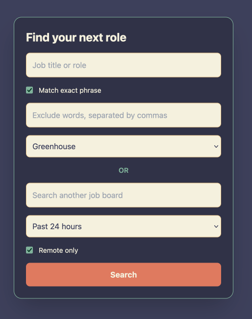

# Jobpapa

This is a simple tool for finding recent job postings on any job board, using Google.

Companies don't usually post roles directly to job boards. Instead, they upload them to their hiring or applicant tracking platform, and the job boards aggregate them from there.

That's not really a big deal on its own, but it does mean most of the useful boards are showing the same roles, and a lot of them now want a subscription before they'll let you see anything.

Some will even leave outdated or expired roles up to look like they're bursting with opportunities, and you usually don't find out until after you've already paid.

Extremely egregious behavior.

Jobpapa goes around all of that and just searches the source directly.  

## Background

This started life as a personal Python script back in 2021 that I passed around to friends, colleagues and students. The original script, included in this repo for sentimental reasons, had its share of issues that I ironed out over the years, but eventually it just became clear that the best version of this was web-based.


|Original script |Web version |
| --- | --- |
| Required user to install Python and run it via the terminal | Doesn't |
| OS-dependant | Isn't |
| Firefox-dependant and would fail if Firefox wasn't installed, even if you had a Firefox-based browser like Librewolf | Browser agnostic |
| Changing or adding anything meant editing the source file. This wasn't ideal for non-techies and/or anyone working without an IDE that would flag/fix small errors for them to simplify the process | Changes made directly in the UI |
| Each search checked every board at once, and it could be frustrating to go through all the results across multiple tabs | Searches run for one board at a time |
| It could only handle one search per instance | Unlimited searches |
| The new-instance tag sometimes caused profile lock errors if Firefox was already running | Not any more <3 |
  

Plus other quality of life improvements:

-  You can search any job board that's not on the list
-  It's more shareable!
- Works great on mobile thanks to a responsive UI from [Tailwind](https://tailwindcss.com/)
  
## Using the web app

It's [hosted on GitHub Pages](https://kjteaches.github.io/jobpapa/), where anyone can access it for free. Just type in a role, pick a board, and hit Search.



That should be enough and I hope I've made the rest intuitive, but let's cover it just in case:

-  **Match exact phrase** keeps multi-word roles like `llama wrangler` together
-  **Exclude words** filters out anything you don't want to see, comma-separated, like `senior, onsite`
-  **Custom board** lets you search any site instead of the dropdown, just paste in a domain like `myboardbulgaria.com`
-  **Time** narrows things down to anywhere from the last 12 hours to the last month
-  **Remote only** adds remote/distributed to the search


## Using the Python script

It's still here if you'd rather use it, but it searches all the boards at once, each in its own _new_ Firefox window:

```bash

python  job_trawler.py

```

  

Set what you're after at the top of the file:

  

```python

role = "llama wrangler"

exact = True

time_filter = "qdr:w"  # h12, d, d3, w, w2, m

exclude = ["senior", "onsite"]

```

**Please note:** it uses the macOS `open` command to launch Firefox, so if you're on Windows or Linux you'll need to tweak the `webbrowser.get(...)` line first or not use it at all.

## Credits

UI components are from [Tailwind](https://tailwindcss.com/), color palette is [Neutral Harmony Bliss](https://coolors.co/palette/f4f1de-e07a5f-3d405b-81b29a-f2cc8f) from Coolors, favicon is from [Icons8](https://icons8.com/icons)
